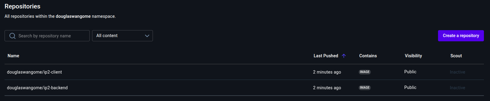

# IP2
For consistency I used, <code>node:16-alpine</code> across both Dockerfiles.

## Client
The <code>package.json</code> for the Client indicates the use of Node.js v13. This version is unstable and no longer actively supported, which could pose security risks for the Docker image in the future. As stated above, I opted for <code>node:16-alpine</code> because it is a stable version that still receives regular updates and security patches, thus mitigating future security concerns.\
\
Below is the Dockerfile for the Client with detailed comments:

```Dockerfile
# Stage 1: This stage builds the React application before serving it in Stage 2.

# Specifies the base image upon which the new image will be built.
# "AS builder" names this stage, allowing it to be referenced in Stage 2.
# Initially, I did not use "alpine" in Stage 1 to maximize compatibility. However,
# downloading the larger node:16 image proved problematic with my unstable internet connection.
# I switched to alpine to successfully complete Stage 1.
FROM node:16-alpine AS builder

# Sets the working directory for subsequent instructions.
WORKDIR /app

# Copies new files or directories from the host machine (source) to inside the image (destination).
# The asterisk (*) is a wildcard, and the .json extension specifies that only JSON files
# matching the 'package' prefix should be copied.
COPY package*.json ./

# Installs all dependencies in the image.
# I chose "npm ci" over "npm i" to ensure that the exact versions specified in package-lock.json are installed,
# promoting consistent builds.
# RUN npm i
RUN npm ci

# Copies the rest of the application files from the host machine to the image.
COPY . .

# This command builds the React application.
RUN npm run build

# Stage 2: This is where the application is "served."

# Specifies the base image for this stage.
# In Stage 2, the focus is on reducing the final image size rather than broad compatibility,
# which explains the continued use of "alpine."
FROM node:16-alpine

# Sets the working directory for subsequent instructions.
WORKDIR /app

# Installs the 'serve' package globally.
RUN npm install -g serve

# Copies the built React application from the 'builder' stage (Stage 1).
# "--from=builder" references the named Stage 1.
COPY --from=builder /app/build ./build

# Exposes port 3000, making it accessible from outside the container.
EXPOSE 3000

# Defines the command to run when the container starts, serving the React application
# from the 'build' directory on port 3000.
CMD [ "serve", "-s", "build", "-l", "3000" ]
```

During the creation of the above Dockerfile, I encountered one major challenge:

- Internet Connectivity: My unstable internet connection was a significant issue. I initially planned to use node:16 to avoid potential compatibility problems. However, node:16 is considerably larger than its alpine counterpart. To successfully build and run the container locally, I switched to the alpine variant. I did not face any compatibility issues, but this is something to monitor in the future.

To run the client image, I use the following command (executed from the client directory):
```bash
docker run -p 3000:3000 #image_id
```

## Backend
Below is the Dockerfile for the Backend with comments to explain everything in great detail:
```Dockerfile
# No multi-stage build is required for this Dockerfile as 'serve' is not needed.

# Specifies the base image upon which the new image will be built.
FROM node:16-alpine

# Sets the working directory for subsequent instructions.
WORKDIR /app

# Copies new files or directories from the host machine (source) to inside the image (destination).
# The asterisk (*) is a wildcard, and the .json extension specifies that only JSON files
# matching the 'package' prefix should be copied.
COPY package*.json ./

# Installs all dependencies in the image.
# I chose "npm ci" over "npm i" to ensure that the exact versions specified in package-lock.json are installed,
# promoting consistent builds.
# RUN npm i
RUN npm ci

# Copies the rest of the application files from the host machine to the image.
COPY . .

# Exposes port 5000, making it accessible from outside the container.
EXPOSE 5000

# Defines the command to run when the container starts, launching the Node.js server.
CMD [ "node", "server.js" ]
```

During the creation of the above Dockerfile, I encountered one major challenge:

- The .env file: It is customary to exclude the .env file when copying the application directory. However, my environment variable (specifically the MONGODB_URI value) contained double quotes within the .env file. This led to errors when attempting to run the container with the --env-file .env flag, as Docker misinterpreted the environment variable, preventing the backend from starting correctly.

To run the backend image, I use the following command (executed from the backend directory):
```bash
docker run -p 5000:5000 --env-file .env #image_id
```

## Docker Compose
To orchestrate both the client and backend services, ensuring they run together, communicate effectively, and utilize persistent storage, a <code>docker-compose.yaml</code> file is used. This file defines a multi-container Docker application with a single configuration.

Here's the <code>docker-compose.yaml</code> file that unites the client and backend:
```yaml
# Specifies the Docker Compose file format version
# version: '3.8'
# The attribute `version` is obsolete, that's why it has been comment out

services:
  # Backend Service Definition
  backend: 
    build:
      context: ./backend # Specifies the build context (where the backend Dockerfile is located)
      dockerfile: Dockerfile # Specifies the Dockerfile to use (optional as it defaults to Dockerfile)
    image: douglaswangome/ip2-backend:latest # Assigns a custom name to the image
    container_name: ip2-backend # Assigns a custom name to the container
    ports:
      - "5000:5000" # Maps port 5000 from the host to port 5000 in the container
    env_file: # Specifies an environment file to load variables from
      - ./backend/.env # Path to the .env file, relative to this file
    networks:
      - ip2-network # Connects the backend service to the custom network
    volumes:
      # This volume is used to persist node_modules to speed up subsequent builds
      # This prevents repeated downloads.
      - backend_node_modules:/app/node_modules
      
  # Client Service Definition
  client:
    build:
      context: ./client # Specifies the build context (where the backend Dockerfile is located)
      dockerfile: Dockerfile # Specifies the Dockerfile to use (optional as it defaults to Dockerfile)
    image: douglaswangome/ip2-client:latest # Assigns a custom name to the image
    container_name: ip2-client # Assigns a custom name to the container
    ports:
      - "3000:3000" # Maps port 3000 from the host to port 3000 in the container
    depends_on:
      - backend # Ensures the backend service starts before the client service
    networks:
      - ip2-network # Connects the client service to the custom network
    volumes:
      # This volume is used to persist node_modules to speed up subsequent builds
      # This prevents repeated downloads.
      - client_node_modules:/app/node_modules

# Network Definition
networks:
  ip2-network:
    name: ip2-network
    driver: bridge # Defines a custom bridge network for inter-service communication

# Volume Definitions
volumes:
  backend_node_modules:
  client_node_modules:
  # I am not running MongoDB as a service hence no need to define its volume
```

### Explanation of Docker Compose Components:
<ul>
  <li><strong><code>services</code>:</strong> This is the core section where you define each individual container (service) that makes up your application. Each service corresponds to a container that Docker Compose will manage.</li>
  <li><strong><code>build</code>:</strong>
    <ul>
      <li><code>context</code>: Specifies the path to the directory containing the <code>Dockerfile</code> and the application code needed for building the image.</li>
      <li><code>dockerfile</code>: (Optional) Specifies the name of the <code>Dockerfile</code> if it's not the default <code>Dockerfile</code>.</li>
    </ul>
  </li>
  <li><strong><code>container_name</code>:</strong> Assigns a specific, human-readable name to the container instance. This makes it easier to identify and manage the container using <code>docker ps</code> or <code>docker logs</code>.</li>
  <li><strong><code>image</code>:</strong> Assigns a specific Docker image to be used for the service. If the image is not available locally, Docker Compose will attempt to pull it from a Docker registry (Docker Hub). If used in conjunction with build, it will tag the newly built image with the specified name.</li>
  <li><strong><code>ports</code>:</strong> Maps ports from your host machine to the container's exposed ports.
    <ul>
      <li>Example: <code>"5000:5000"</code> means traffic on port <code>5000</code> on your host machine will be forwarded to port <code>5000</code> inside the container.</li>
    </ul>
  </li>
  <li><strong><code>env_file</code>:</strong> This attribute specifies one or more files from which to load environment variables into the service's container.
    <ul>
      <li><code>./backend/.env</code>: In this configuration, Docker Compose will look for a <code>.env</code> file inside your <code>backend</code> directory (relative to the <code>docker-compose.yaml</code> file) and inject all key-value pairs found there as environment variables into the <code>backend</code> container. This is crucial for keeping sensitive information like database connection strings out of your <code>Dockerfile</code> and <code>docker-compose.yaml</code>.</li>
    </ul>
  </li>
  <li><strong><code>networks</code>:</strong> This section defines which Docker networks a service will connect to.
    <ul>
      <li><code>ip2-network</code>: Both <code>backend</code> and <code>client</code> services are connected to this custom network. This allows them to communicate with each other using their service names (e.g., the client can make requests to <code>http://backend:5000</code> without needing to know the backend container's IP address). Using a custom network provides better isolation and easier service discovery compared to Docker's default bridge network.</li>
    </ul>
  </li>
  <li><strong><code>volumes</code>:</strong> This attribute is used for data persistence and sharing between the host and containers, or between containers.
    <ul>
      <li><strong>Named Volumes (<code>backend_node_modules</code>, <code>client_node_modules</code>):</strong> These are Docker-managed volumes that persist data even if the containers are removed. They are ideal for caching dependencies like <code>node_modules</code>. By mounting <code>backend_node_modules:/app/node_modules</code>, Docker will store the <code>node_modules</code> directory for the backend in a persistent volume. This means <code>npm ci</code> won't have to re-download all dependencies every time you rebuild or restart the container, significantly speeding up development iterations. The same applies to <code>client_node_modules</code>.</li>
      <li><strong>Bind Mounts (Implicitly removed in your latest YAML, but common for dev)</strong>: While not in your provided YAML, often in development, you'd also include bind mounts like <code>./backend:/app</code> and <code>./client:/app</code>. These directly link a directory on your host machine to a directory inside the container. This is useful for live development, as changes made to your code on the host are immediately reflected in the container without needing to rebuild the image.</li>
    </ul>
  </li>
  <li><strong><code>depends_on</code>:</strong> This specifies that a service depends on another service. Docker Compose will start the dependencies in the correct order.
    <ul>
      <li><code>depends_on: - backend</code>: Ensures that the <code>backend</code> service is started and running before the <code>client</code> service attempts to start. This is important to prevent the client from failing if it tries to connect to a backend that isn't yet available.</li>
    </ul>
  </li>
  <li><strong>Top-level <code>networks</code> section:</strong> This is where you define the custom networks used by your services.
    <ul>
      <li><code>ip2-network</code>: Declares a new network named <code>ip2-network</code> with the <code>bridge</code> driver. This creates a virtual network that services can join.</li>
    </ul>
  </li>
  <li><strong>Top-level <code>volumes</code> section:</strong> This is where you declare the named volumes that your services will use. Declaring them here makes them available for use by any service in the <code>docker-compose.yaml</code>.</li>
</ul>

### How to run
<ol>
  <li><strong>Clone the Repository</strong>: First, clone the project repository to your local machine.</li>
  <li><strong>Navigate to Project Root</strong>: Open your terminal and change into the my-project/ directory. This is where the <code>docker-compose.yaml</code> file should be located.</li>
  <li> 
    Add Your MongoDB Connection String: (Create an <code>.env</code> file inside the backend)

    MONGO_URI=YOUR_CONNECTION_STRING
  </li>
  <li>
  Run Docker Compose: Execute the following command:

  ```bash
  docker compose up --build
  ```
  <ul>
    <li>
      <strong>up</strong>: This command starts the services defined in your docker-compose.yaml file.
    </li>
    <li>
      <strong>--build</strong>: This flag forces Docker Compose to rebuild the images for your backend and client services. This is crucial when you've made changes to your Dockerfiles or application code. You can omit this flag on subsequent runs if no Dockerfile or dependency changes have occurred.
    </li>
  </ul>
  </li>
</ol>

### Screenshot of the pushed images
